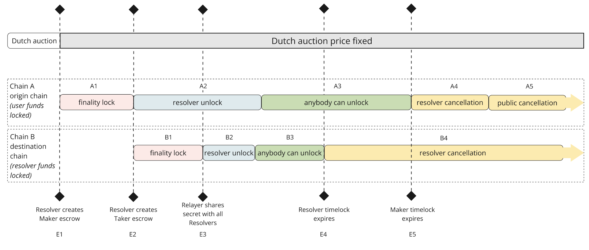

# Cross-Chain Atomic Swap Protocol

A secure cross-chain atomic swap protocol built on Aptos that enables trustless asset swaps across different blockchains. This is the Aptos implementation of the [1inch Fusion Plus](https://github.com/1inch/cross-chain-swap) protocol.

## Overview

The protocol enables secure cross-chain swaps through a clean separation of concerns with hashlocked and timelocked escrows. It consists of several key components that work together to provide a secure, trustless cross-chain swap experience.

## 🧪 Testing Scripts

This repository includes comprehensive testing scripts in the `scripts/` directory that implement a complete cross-chain atomic swap flow on Aptos testnet.

### Quick Start

```bash
# Install and setup testing scripts
npm run setup

# Run complete test suite
npm test

# Run main application
npm start

# Development mode with hot reload
npm run dev
```

### Test Coverage

The testing scripts provide:

- ✅ **Complete Cross-Chain Flow**: Fusion order creation → Acceptance → Escrow creation → Withdrawal
- ✅ **Real Event Listening**: Extracts actual object addresses from blockchain events
- ✅ **Production-Ready**: Uses real testnet transactions with proper error handling
- ✅ **Latest SDK Integration**: Uses Aptos TypeScript SDK v4.0.0

### Key Features

- **Event-Driven Architecture**: Successfully extracts object addresses from `FusionOrderCreatedEvent` and `EscrowCreatedEvent`
- **Real Transaction Testing**: All tests use actual testnet transactions
- **Complete Flow Testing**: Tests the entire cross-chain atomic swap lifecycle
- **Error Handling**: Proper fallback mechanisms and timing constraint handling

For detailed documentation, see [scripts/README.md](scripts/README.md).

## Core Components

1. **Fusion Orders (`fusion_order.move`)**
   - User-created orders that can be cancelled before pickup
   - **Users only deposit main asset (no safety deposit)**
   - **Resolvers provide safety deposit when accepting orders**
   - Order cancellation by owner
   - Friend function for converting to escrow

2. **Escrow (`escrow.move`)**
   - Secure asset escrow with timelock and hashlock protection
   - Two creation methods: from fusion order or directly from resolver
   - **Assets locked in escrow (not with resolver)**
   - **Only resolvers can call withdraw**
   - Timelock-based phase management
   - Hashlock-based secret verification
   - Asset withdrawal and cancellation logic
   - **Source chain: resolver gets tokens**
   - **Destination chain: user gets tokens**

3. **Resolver Registry (`resolver_registry.move`)**
   - Resolver registration and status management
   - Admin functions for resolver management

4. **Timelock (`timelock.move`)**
   - Phase management for escrow lifecycle
   - Configurable duration validation
   - Phase transition logic
   - Individual phase duration validation

5. **Hashlock (`hashlock.move`)**
   - Secret verification for asset withdrawal
   - Hash-based security mechanism

6. **Constants (`libs/constants.move`)**
   - Protocol-wide configuration
   - Safety deposit settings
   - Timelock duration defaults

### Architecture Flow

```
[SOURCE CHAIN]                       [DESTINATION CHAIN]

User creates Fusion Order
         ↓
   [Can be cancelled by user]
         ↓
Resolver accepts order              Resolver creates escrow
         ↓                                   ↓
   Fusion Order → Escrow                Escrow
         ↓                                   ↓
   [Assets locked in escrow]         [Assets locked in escrow]
         ↓                                   ↓
                    [Timelock phases begin]
                                 ↓
                    [Hashlock protection active]
                                 ↓
                    [Only resolver can withdraw]
                                 ↓
                    [Destination: User gets tokens]
                                 ↓
                    [Source: Resolver gets tokens]
```

### Cross-Chain Atomic Swap Flow

1. **Order Creation**
   - User creates fusion order with main asset only
   - No safety deposit from user (resolver provides later)

2. **Order Acceptance**
   - Resolver monitors `FusionOrderCreatedEvent`
   - Resolver provides safety deposit when accepting
   - Assets extracted for escrow creation (not to resolver)

3. **Escrow Creation**
   - Source chain escrow created with user's assets + resolver's safety deposit
   - Resolver creates matching destination chain escrow
   - Both escrows use same hashlock secret

4. **Withdrawal Process**
   - **Only resolvers can call withdraw**
   - **Destination chain first**: User gets tokens, resolver gets safety deposit
   - **Source chain second**: Resolver gets tokens, resolver gets safety deposit

### Timelock Phases



1. **Finality Phase**
   - Initial period where settings can be modified
   - Recipient can be set or updated
   - No withdrawals allowed

2. **Exclusive Phase**
   - Only intended recipient can claim assets
   - Requires valid secret for withdrawal
   - Hashlock verification required
   - **Only resolvers can withdraw**

3. **Private Cancellation Phase**
   - Owner can cancel and reclaim assets
   - Requires no prior withdrawal
   - Admin-only recovery

4. **Public Cancellation Phase**
   - Anyone with the correct secret can claim
   - Anyone can cancel if not claimed
   - Public recovery available

### Security Model

- **Hashlock Protection**: Assets locked until correct secret
- **Timelock Protection**: Phased access control
- **Cross-Chain Atomic**: Same secret works on both chains
- **Resolver Control**: Only resolvers can withdraw
- **User Protection**: Users never call withdraw
- **Safety Deposit**: Only resolvers provide safety deposits

### Economic Flow

1. **User**: Deposits main asset only (no safety deposit)
2. **Resolver**: Provides safety deposit when accepting order
3. **Escrow**: Locks both main asset and safety deposit
4. **Withdrawal**: 
   - Destination: User gets tokens, resolver gets safety deposit
   - Source: Resolver gets tokens, resolver gets safety deposit

## Project Structure

```
aptos-contracts/
├── sources/                   # Move smart contracts
│   ├── fusion_order.move      # Order creation and management
│   ├── escrow.move            # Hashed timelocked Escrow logic
│   ├── resolver_registry.move # Resolver management
│   ├── timelock.move          # Timelock management
│   ├── hashlock.move          # Hashlock verification
│   └── libs/
│       └── constants.move     # Protocol constants
├── tests/                     # Tests
│   ├── fusion_order_tests.move
│   ├── escrow_tests.move
│   ├── resolver_registry_tests.move
│   ├── timelock_tests.move
│   ├── hashlock_tests.move
│   └── helpers/
│       └── common.move        # Test utilities
├── assets/                    # Documentation assets
│   └── timelocks.png         # Timelock phase diagram
├── Move.toml                  # Project configuration
└── README.md                  # This file
```

## Requirements

Before you begin, you need to install the following tools:

- [Aptos CLI](https://aptos.dev/tools/aptos-cli/)
- [Move Prover](https://aptos.dev/tools/install-move-prover/)

## Quickstart

1. **Clone and navigate to the project**:
```bash
cd aptos-contracts
```

2. **Build the project**:
```bash
aptos move compile --dev
```

3. **Run tests**:
```bash
aptos move test --dev
```

4. **Deploy the contracts**:
```bash
aptos move publish --named-addresses aptos_fusion_plus=YOUR_ACCOUNT_ADDRESS
```

## Usage

### For Users

1. **Create Order**:
```move
fusion_order::new_entry(
    signer: &signer,
    source_metadata: Object<Metadata>,
    source_amount: u64,
    destination_asset: vector<u8>,
    destination_recipient: vector<u8>,
    chain_id: u64,
    hash: vector<u8>,
    initial_destination_amount: u64,
    min_destination_amount: u64,
    decay_per_second: u64
);
```

2. **Cancel Order** (before resolver picks up):
```move
fusion_order::cancel(signer: &signer, fusion_order: Object<FusionOrder>);
```

### For Resolvers

1. **Monitor Events**: Listen for `FusionOrderCreatedEvent`
2. **Accept Order**: Call `escrow::new_from_order_entry(resolver: &signer, fusion_order: Object<FusionOrder>)`
3. **Create Destination Escrow**: Call `escrow::new_from_resolver_entry()` with matching parameters
4. **Withdraw**: Call `escrow::withdraw(signer: &signer, escrow: Object<Escrow>, secret: vector<u8>)` on both chains
5. **Recovery**: Call `escrow::recovery(signer: &signer, escrow: Object<Escrow>)` if needed

## Development

### Testing

The project includes comprehensive test suites for all modules:

```bash
# Run all tests
aptos move test --dev

# Run specific test file
aptos move test --dev --filter fusion_order_tests

# Run with verbose output
aptos move test --dev --verbose
```

### Building

```bash
# Development build
aptos move compile --dev

# Production build
aptos move compile

# Build with verification
aptos move compile --dev --verify
```

### Deployment

```bash
# Deploy to devnet
aptos move publish --named-addresses aptos_fusion_plus=YOUR_ACCOUNT_ADDRESS --network devnet

# Deploy to testnet
aptos move publish --named-addresses aptos_fusion_plus=YOUR_ACCOUNT_ADDRESS --network testnet

# Deploy to mainnet
aptos move publish --named-addresses aptos_fusion_plus=YOUR_ACCOUNT_ADDRESS --network mainnet
```

### Deployed Contract Addresses

The contracts have been deployed to the following networks:

**Testnet:**
- **Account Address**: `0x2cb2b191738c0c6311314ea06c4c8e489db62c8df1a72c11bdd3192186ed8eac`
- **Package Name**: `aptos_fusion_plus`
- **Source Digest**: `E589ACFD8E14A36E2662B4989C7B53B2C968305AD614B241A63726F14022F839`

**Devnet:**
- **Account Address**: `0x2cb2b191738c0c6311314ea06c4c8e489db62c8df1a72c11bdd3192186ed8eac`
- **Package Name**: `aptos_fusion_plus`
- **Source Digest**: `F55716ADDD6B9F76E04DC3F0040E7F4FE5707630978A9423FC7666844F4DA56F`

**Mainnet:**
- Not yet deployed (pending security audits and testing)

### Interacting with Deployed Contracts

To interact with the deployed contracts, you can use the Aptos CLI or SDK:

```bash
# View account resources on testnet
aptos account list --account 0x2cb2b191738c0c6311314ea06c4c8e489db62c8df1a72c11bdd3192186ed8eac --profile testnet

# View account resources on devnet
aptos account list --account 0x2cb2b191738c0c6311314ea06c4c8e489db62c8df1a72c11bdd3192186ed8eac --profile devnet
```


### Extend Fusion+ to Aptos

**Key Protocol Alignments:**
- **Safety Deposits**: Only resolvers provide safety deposits (users never do)
- **Asset Flow**: Assets stay locked in escrow (not with resolver)
- **Withdrawal Control**: Only resolvers can call withdraw
- **Cross-Chain Atomic**: Proper source/destination chain flow

Until the resolver picks up the order, the user retains full control and can withdraw their funds from the `fusion_order` at any time, effectively cancelling their order. This provides users with the same flexibility as the EVM version while respecting Move's ownership principles.

Besides this, my implementation closely follows the EVM version's architecture, with everything divided into separate modules for clarity and readability: `fusion_order.move` handles order creation on maker side, `escrow.move` manages asset with a timelock and hashlock and `resolver_registry.move` manages the whitelisted resolvers.

## License

This project is licensed under the MIT License - see the LICENSE file for details.

## Support

For questions and support, please open an issue on GitHub or contact the development team.
